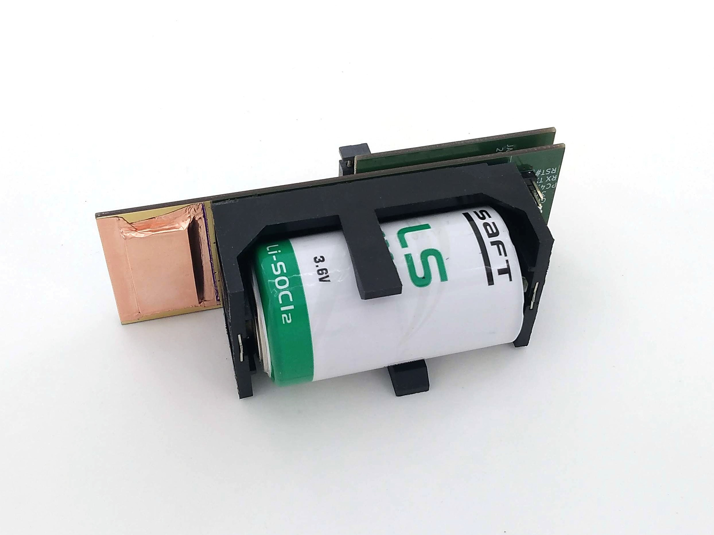

# SPACEDOS02A

**Technical parameters are following:** 

* Silicon PIN diode detector with 60 mm³ detection volume
* Measurement environment - atmosphere > 70 kPa
* Measurement endurance 90 days
* Number of energy channels 250
* Deposited energy range from 200 keV to 12 MeV
* Energy measurement resolution < 50 keV/channel
* Power supply - battery 3.6 V LS 33600 
* Storage - SDcard
* H x W  x  L - 60mm x 38mm x 111 mm  

