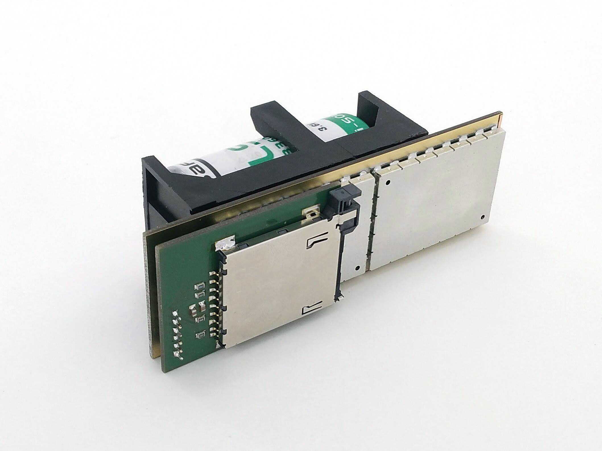

# SPACEDOS02A - PIN diode dosimeter for manned spacecraft 

SPACEDOS is a miniature and lightweight version of [AIRDOS02](https://github.com/UniversalScientificTechnologies/AIRDOS02) dosimeter modified for use on board of manned spacecraft.

The device is currently being used onboard ISS. The following pictures show the processed data from the flight. Here is a radiation map, where the [South Atlantic Anomaly](https://en.wikipedia.org/wiki/South_Atlantic_Anomaly) is clearly visible.

The following spectrum is a cumulative sum of the all the measured particles. 

## Technical parameters are as follows:

* Silicon PIN diode detector with 10x20x0.3 ~ 60 mm³ detection volume
* Measurement environment: atmosphere > 70 kPa
* Measurement endurance: 120 days (4 months of measurement)
* Number of energy channels: 240
* Integration time: CUstomizable in wide range from miliseconds to minutes
* Deposited energy range: from 180 keV to 8.5 MeV
* Energy measurement resolution: < 50 keV/channel
* Thermal stability: 1 channel per 12 °C
* Power supply: battery 3.6 V LS 33600
* Power consumption: < 10 mW during measurement, < 120 mW during writing to SD card
* Data storage media: Standard size SDcard, Industry-grade SLC  SD card
* Interface: RS232/UART 3.3V TTL
* Radiation durability: 50 mGy - currently limited by the durability of a storage media
* Dimensions(HxWxL): 60mm x 39mm x 113 mm
* Mass / (including battery): 58/148 g 

Relevant scientific publications

* [SPACEDOS: AN OPEN-SOURCE PIN DIODE DOSEMETER FOR APPLICATIONS IN SPACE](https://academic.oup.com/rpd/article-abstract/198/9-11/611/6673003?redirectedFrom=fulltext&login=false)
* [SPACEDOS an open-source PIN diode dosimeter for applications in Space](https://indico.ujf.cas.cz/event/2/contributions/27/attachments/25/46/Po-1315-Kakona-774711333.pdf)
