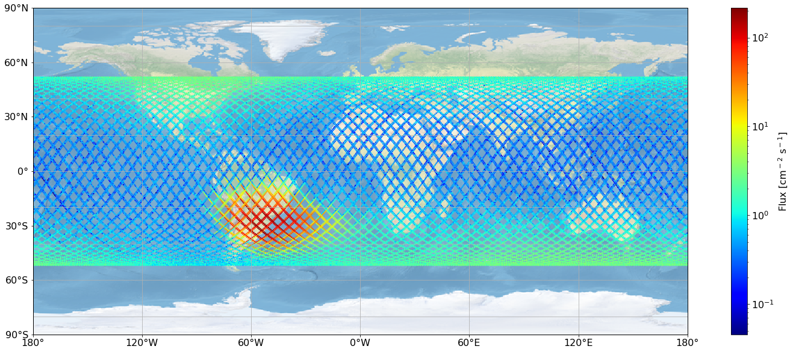
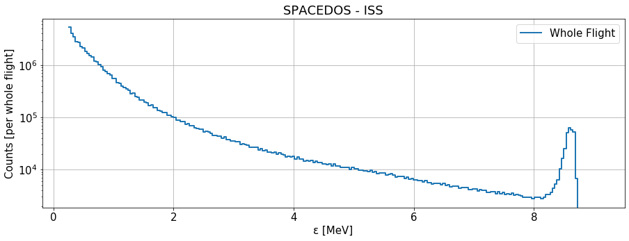



SPACEDOS is a miniature and lightweight version of [AIRDOS02](https://github.com/UniversalScientificTechnologies/AIRDOS02) cosmic radiation dosimeter for use on board manned spacecraft.

The device is being used onboard ISS. The following pictures show the processed data from a flight. Here is a radiation map, where the [South Atlantic Anomaly](https://en.wikipedia.org/wiki/South_Atlantic_Anomaly) is visible.

The following spectrum is a cumulative sum of all the measured particles during the flight.

